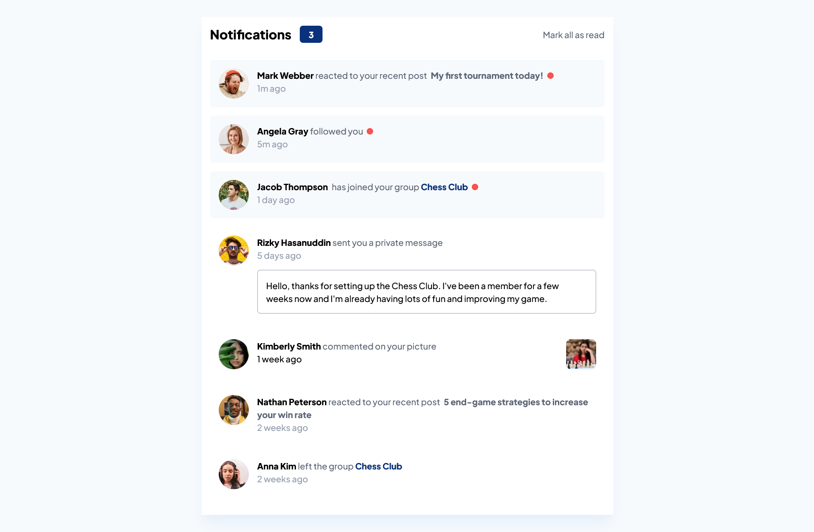

# Frontend Mentor - Notifications page solution

This is a solution to the [Notifications page challenge on Frontend Mentor](https://www.frontendmentor.io/challenges/notifications-page-DqK5QAmKbC). Frontend Mentor challenges help you improve your coding skills by building realistic projects.

## Table of contents

- [The challenge](#the-challenge)
- [Screenshot](#screenshot)
- [Links](#links)
- [My process](#my-process)
  - [Built with](#built-with)
  - [What I learned](#what-i-learned)
  - [Useful resources](#useful-resources)
- [Author](#author)

### The challenge

Users should be able to:

- Distinguish between "unread" and "read" notifications
- Select "Mark all as read" to toggle the visual state of the unread notifications and set the number of unread messages to zero
- View the optimal layout for the interface depending on their device's screen size
- See hover and focus states for all interactive elements on the page

### Screenshot

### Links

- Solution URL: [https://www.frontendmentor.io/solutions/notifications-page-using-tailwind-css-O96ubnEFnl](https://www.frontendmentor.io/solutions/notifications-page-using-tailwind-css-O96ubnEFnl)
- Live Site URL: [https://notifications-page-rahul.vercel.app](https://notifications-page-rahul.vercel.app)

## My process

### Built with

- HTML
- [Tailwind CSS](https://tailwindcss.com)
- JavaScript
- Mobile-first workflow

### What I learned

- Tailwind CSS

### Useful resources

- [Tailwind CSS](https://tailwindcss.com)

## Author

- Website - [Dasu Rahul](https://dasu-rahul.netlify.app)
- Frontend Mentor - [@dasurahul](https://www.frontendmentor.io/profile/dasurahul)
- LinkedIn - [Dasu Rahul](https://linkedin.com/in/dasu-rahul)
- Twitter - [@dasu_rahul](https://www.twitter.com/dasu_rahul)
